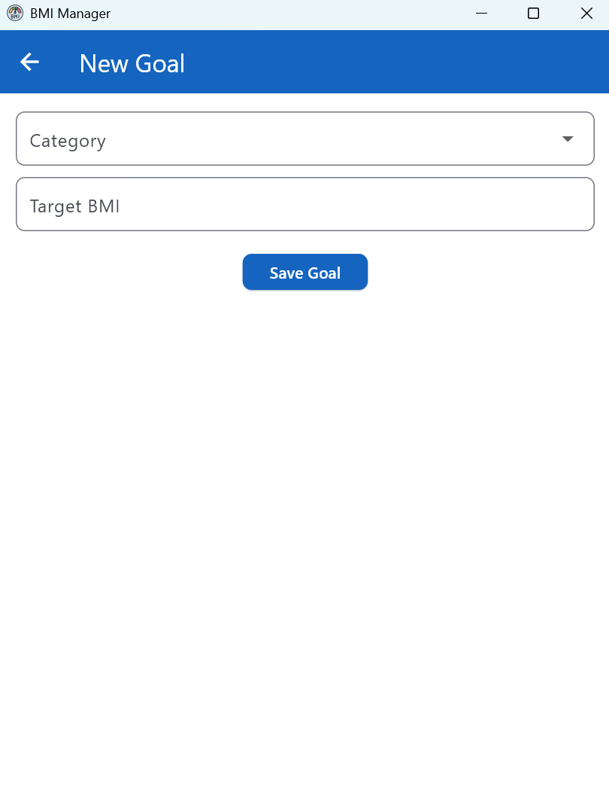

# BMI Manager

This is a Flutter BMI manager project. It's a study project that should meet the following requirements:

- View BMI information
- Enter measurement data
- View analyzed measurement data with BMI
- Save measurement data
- View list of saved measurement data
- View list of categories
- View details for a category
- Register user
- Login

## Prerequisites

Ensure the following tools are installed on your system:

- [Flutter SDK](https://flutter.dev/docs/get-started/install)
- [Dart SDK](https://dart.dev/get-dart)
- [Android Studio](https://developer.android.com/studio) or [VS Code](https://code.visualstudio.com/) (optional)
- Android Emulator or real device for testing (optional)

## Getting started

### install dependencies

```bash
flutter pub get
```

### run
```bash
flutter run
```

## Screens

### Login


### Register


### History


### New Measurement


### Goals


### Add Goal


### Achievement Screen


### Settings


### Categories


### Category Detail


## Development

### App Icon

If you change the app icon under `assets/icon` make sure you adjust the paths under `flutter_launcher_icons:` in `pubspec.yaml` and run:

```bash
flutter pub run flutter_launcher_icons:main
```

### Database Schema

If you change anything inside `lib/database/app_database.dart` you have to run:

```bash
dart run build_runner build --delete-conflicting-outputs
```

I am using `drift` as a low level ORM

### Translations (l10n)

If you change translations installing dependencies is enough

```bash
flutter pub get
```
